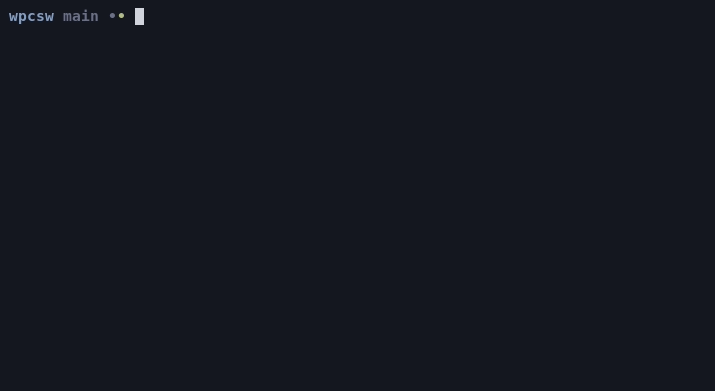

# Wstęp do programowania w C w systemach wbudowanych

## Zadanie 1

Napisz program który po uruchomieniu wyświeli twoje imię i nazwisko.
Skompiluj go za pomocą `gcc` i uruchom z terminala.

```c
$ ./a.out
Jan Kowalski
```

## Rozwiązanie 1

```c
#include <stdio.h>

int main(void)
{
	printf("Jan Kowalski\n"); 
	return 0;
}
```

Znak `\n` to znak nowej linii (czyli "enter").

Następnie:

```console
$ gcc main.c -o imieinazwisko
$ ./imieinazwisko
Jak Kowalski
```

## Zadanie 2

Napisz program który przyjmuje 2 argumenty: imie i nazwisko, a następnie
je wyświetla. 

```c
$ ./a.out Przemyslaw Czarnota
Przemyslaw Czarnota
$ echo $?
0
```

Podanie niepoprawnej liczby argumentów, powinno skutkować
wyświetleniem błędu na standardowy strumień błędów oraz zwróceniem
kodu błędu różnego od 0.

```
$ ./a.out Za duzo argumentow >/dev/null
error: wrong number of arguments
$ echo $?
1
```

## Rozwiązanie 2

```c
#include <stdio.h>

int main(int argc, char **argv)
{
	if (argc != 3) {
		fprintf(stderr, "error: wrong number of arguments\n");
		return 1;
	}

	printf("%s %s\n", argv[1], argv[2]);
	return 0;
}
```

Gdy uruchamiamy `./program Jan Kowalski`, system operacyjny jako drugi argument
funkcji `main()` przekazuje następującą tablicę ciągów znaków:

```c
char *argv[] = { "./program", "Jan", "Kowalski" };
```

Warto zauważyć że wywołanie systemowe `execvp` przyjmuje podobny argument :)

## Zadanie 3

Napisz program, który będzie odczytywał ze standardowego wejścia
liczby do momentu wystąpienia wejścia, które nie jest liczbą lub
końca strumienia i na końcu wyświetli ich średnią arytmetyczną.

```c
$ ./a.out
1
2
3            <--- tu wcisnąłem Ctrl-d
2.000000
```

Przydatne funkcje:

- `scanf()` - odczytuje zmienne ze standardowego wejścia

Skrót klawiaturowy `Ctrl-d`, powoduje wysłanie znaku końca pliku.

## Rozwiązanie 3

```c
#include <stdio.h>

int main(void)
{
	int sum = 0;
	int count = 0;

	while (1) {
		int number;

		int num = scanf("%d", &number);
		if (num != 1)
			break;
		sum += number;
		count++;
	}

	printf("%f\n", (float)sum / count);
	return 0;
}
```

## Rozwiązanie 3 - alternatywne

```c
#include <stdio.h>

int main(void)
{
	int sum = 0, count = 0, number;

	while (scanf("%d", &number) == 1) {
		sum += number;
		count++;
	}

	printf("%f\n", (float)sum / count);
	return 0;
}
```

## Zadanie 4

Napisz program, który będzie odczytywał liczby ze standardowego wejścia
i wypisze je w odwrotnej kolejności.

```c
$ seq 1 3 | ./a.out
3
2
1
```

Program powinien działać maksymalnie dla 4096 liczb całkowitych.
Dalsze liczby są odrzucane.

Do rozwiązania będzie potrzebne wykorzystanie tablicy. Na przykład
```c
int tablica[4096];
```

## Rozwiązanie 4

```c
#include <stdio.h>

int main(void)
{
	int numbers[4096];
	int count = 0;
	int number;
	/* Dopóki liczby są na standardowym wejściu */
	while (1 == scanf("%d", &number)) {
		if (count >= 4096)
			break;
		numbers[count] = number;
		count++;
	}

	for (int i = count - 1; i >= 0; --i)
		printf("%d\n", numbers[i]);

	return 0; 
}
```

## Zadanie 5

Napisz program który wyświetli wszystkie argumenty przekazane do programu
```c
$ ./a.out a b d e foo bar
a
b
d
e
foo
bar
```

## Rozwiązanie 5

```c
#include <stdio.h>

int main(int argc, char **argv)
{
    for (int i = 1; i < argc; ++i)
        printf("%s\n", argv[i]);

    return 0;
}
```

## Zadanie 6

Napisz program, który będzie odczytywał ze standardowego wejścia
liczby do momentu wystąpienia wejścia, które nie jest liczbą lub
końca strumienia i na końcu wyświetli najmniejszą liczbę. Program powinien
też działać dla liczb ujemnych.

```c
$ ./a.out
1
-2
2
-1
-2            <--- tu wcisnąłem Ctrl-d co powoduje wyświetlenie wyniku
```

Przydatne funkcje:

- `scanf()` - odczytuje zmienne ze standardowego wejścia

## Rozwiązanie 6

```c
#include <stdio.h>

int main(int argc, char **argv)
{
    int min, number;
    if (1 != scanf("%d", &min))
        return 0;

    while (1 == scanf("%d", &number)) {
        if (number < min)
            min = number;
    }

    printf("%d\n", min);

    return 0;
}
```

## Zadanie 7

Rozwiń program z Zadania 4, tak aby działał
dla dowolnej ilości liczb, która jest podana jako pierwszy argument.

```c
./a.out 5
1
2
3
4
5
5
4
3
2
1
```

## Rozwiązanie 7

```c
#include <stdio.h>
#include <stdlib.h>

int main(int argc, char **argv)
{
    int max_count, count = 0, number;
    if (argc != 2)
        return 1;
    if (1 != sscanf(argv[1], "%d", &max_count))
        return 1;

    int *numbers = malloc(max_count * sizeof(numbers[0]));
    /* Dopóki liczby są na standardowym wejściu */
    while (count < max_count && 1 == scanf("%d", &number)) {
        numbers[count] = number;
        count++;
    }
    for (int i = count - 1; i >= 0; --i)
        printf("%d\n", numbers[i]);

    free(numbers);
    return 0; 
}
```

## Zadanie 8

Rozwiń program z Zadania 4, tak aby działał
dla dowolnej ilości liczb, ale bez podawania maksymalnej
ilości liczb jako pierwszy argument. Wewnętrzna tablica powinna się
dynamicznie rozszerzać.

Przydatne funkcje:

- `malloc()` - alokuje pamięć
- `realloc()` - realokuje pamięć
- `free()` - zwalnia pamięć
- `memcpy()` - kopiuje dane

Sprawdź czy nie ma wycieków pamięci:

```console
$ valgrind --leak-check=full --show-leak-kinds=all ./program

$ gcc main.c -fsanitize=address -o program
$ ./program
```

## Rozwiązanie 8

```c
#include <stdio.h>
#include <stdlib.h>

int main(int argc, char **argv)
{
    int *numbers = NULL; /* realloc(NULL, ...) i free(NULL) jest ok */
    int count = 0;
    int number;
    while (1 == scanf("%d", &number)) {
	numbers = realloc(numbers, (count + 1) * sizeof(numbers[0]));
	if (!numbers)
		goto out; /* goto nie jest "złe", jeżeli używamy do obsługi błędów */
        numbers[count] = number;
        count++;
    }
    for (int i = count - 1; i >= 0; --i)
        printf("%d\n", numbers[i]);
out:
    free(numbers);
    return 0; 
}
```

## Zadanie rozgrzewkowe

Napisz program który będzie działał jak program `yes`.
```c
$ ./program | head -n 3
y
y
y
```

```c
$ ./program no | head -n 3
no
no
no
```

Z tą drobną różnicą, że będzie obsługiwał tylko jeden argument.

## Zadanie 9

Napisz funkcję która będzie sortować tablicę liczb typu `int` algorytmem
sortowania bąbelkowego. Pseudokod:
```
sort(items, len) {
    for (i = 0; i < len - 1; j++) {
        for (j = 0; j < len - 1 - i; j++) {
            if (items[j] > items[j + 1])
                swap(items[j], items[j + 1]);
        }
    }
}
```

Wykorzystanie:

```c
int n[] = {8, 3, 4, 5, 6, 7, 8};
sort(n, 7);
```

## Zadanie 10

Napisz funkcję która będzie sortować tablicę liczby typu `float` algorytmem
sortowania bąbelkowego. Dodaj do niej parametr określający porządek sortowania.

```c
void sort_float(float *items, unsigned int len, bool reversed);
```

Wykorzystanie:

```c
float n[] = {8.0f, 3.0f, 4.0f, 5.0f, 6.0f, 7.0f, 8.0f};
sort_float(n, 7, false);
```

## Zadanie 11

Zdefiniuj makro `ARRAY_SIZE()`, które pozwoli obliczać liczbę elementów
w tablicy w trakcie kompilacji (jeżeli rozmiar jest znany w trakcie kompilacji)

```c
int n[] = {8, 3, 4, 5, 6, 7, 8};
sort(n, ARRAY_SIZE(n));
```

```c
float n[] = {8.0f, 3.0f, 4.0f, 5.0f, 6.0f, 7.0f, 8.0f};
sort_float(n, ARRAY_SIZE(n));
```

Przydatny operator:

- `sizeof(x)` - podaje rozmiar wyrażenia

## Zadanie 12

Napisz generyczną funkcję `sort()`, która może posortować tablicę
dowolnego typu:

```c
void sort(void *ptr, unsigned int count, unsigned int element_size,
          int (*comparator)(const void *a, const void *b));
```

```c
int compare_double(const void *__a, const void *__b)
{
    const double *a = __a, *b == __b;
    if (*a == *b)
        return 0;
    return *a < *b ? -1 : 1;
}
```

```c
double items[] = { 2.0f, 8.0f, -1.0f, 3.0f };
sort(items, ARRAY_SIZE(items), sizeof(items[0]), compare_double);
```
Funkcja powinna dawać taki sam efekt jak `qsort()`.

## Zadanie 13

Napisz program który jako pierwszy argument przyjmie ciąg znaków. Następnie
wypisze ciąg znaków, zamieniając wszystkie duże litery na małe.

```c
$ ./program "This Should Be Small 1234"
this should be small 1234
```

Zamiana znaków powinna się dokonać z wykorzystaniem autorskiej funkcji
```c
void autorskafunkcjadozamianyznakow(char *str);
```

Przydatne informacje:

- Kopiowanie ciągów znaków można osiągnąc za pomocą `memcpy()`, `strncpy()`, `strcpy()`, `snprintf()`.
- Aby zamienic dużą literę na małą wystarczy dodać do niej `'a' - 'A'`.
- Należy sprawdzić czy `'A' <= litera && litera <= 'Z'`.

## Zadanie 14

Terminalem, na który wypisujemy można sterować specjalnymi kodami ANSI
([https://en.wikipedia.org/wiki/ANSI_escape_code](https://en.wikipedia.org/wiki/ANSI_escape_code)).
Możemy w ten sposób na przykład:
```c
fprintf(stderr, "%c[2J", 0x1b); /* Wyczyścić ekran */
fprintf(stderr, "%c[%d;%dH", 0x1b, y, x); /* Umieścić kursor w wierszu y i kolumnie x */
```
Napisz 2 funkcje:

```c
/* Czyści ekran */
void clrscr(void);
/* Umieszcza kursor w wierszu y i kolumnie x */
void gotoxy(int x, int y);
```
Narysuj za ich pomocą animację przypominającą "kod z matrixa". Do generowania
liczb losowych możesz użyć `rand()`. Do kontroli szybkości animacji `usleep()`.

## Zadanie 14 - Efekt


